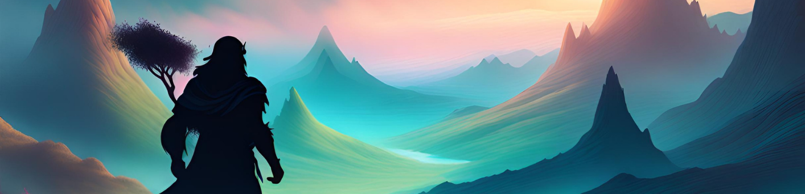
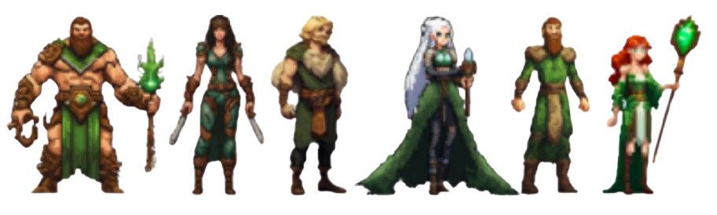

  

# **Projet POO Java**
## **Création d'un jeu Donjon & Dragon**
###### Réalisé par Daniel TEIXEIRA VENANCIO, Louna SICARD, Ines MAZOUZ

 

**Bienvenue au Royaume d'Oraculum !** Ici, vivent en harmonie 5 tribus aux capacités magiques. Suite à une malédiction, un élu (vous !) fut désigné pour sauver le Royaume.

**Votre mission :** Rétablir la paix en décrochant les 5 reliques, perdues dans chacune des 5 tribus.

 

### **Lancement du jeu**

Pour exécuter le jeu :

1. Téléchargez le fichier "desktop-1.0.jar".
2. Exécutez-le en double-cliquant dessus ou ouvrez un terminal dans le répertoire du fichier et exécutez la commande :

$ java -jar desktop-1.0.jar

 

Le fichier compressé "Java_OOP_Project.zip" est une version compressée du code source. Pour le lire, décompressez le fichier et accédez au chemin /Java_OOP_Project/core/src/com/mygdx/game.

 

### **Description du projet**

Ce projet est un jeu de rôle type Donjon & Dragon. 
Il nous permet de mettre en oeuvre nos capacitées en Interface Homme Machine, ACO et Programmation Java.

 

### **Technologie utilisée**

Ce jeu est basé sur la librairie Libgdx afin de réaliser l'interface. Nous codons nos classes en Java.
 

 

### **Fonctionnalités (quoi dans les repertoires)**

 Le code a été développé selon un modèle de conception MVC (Modèle, Vue, Contrôleur).Chaque dossier du MVC représente l'emplacement des codes respectifs.

 

### **Présentation des personnages**

6 personnages différents sont disponibles !

  

